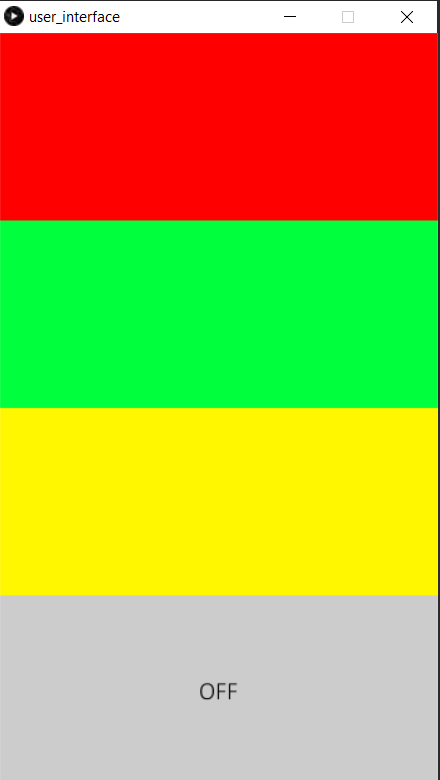
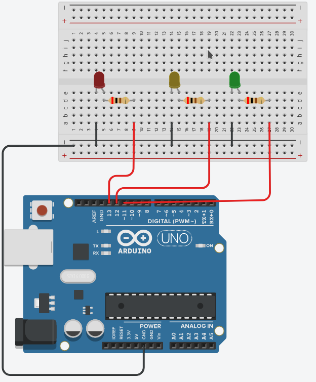

# Enciende leds desde un panel de control gráfico

## Panel de control de luces  
### Referencia librería GUI ControlP5
http://www.sojamo.de/libraries/archive/controlP5-0-3-14/reference/controlp5_class_controlp5.htm  

## Circuito arduino uno
Simulación: https://www.tinkercad.com/things/k6FUUQ7dDZi  

